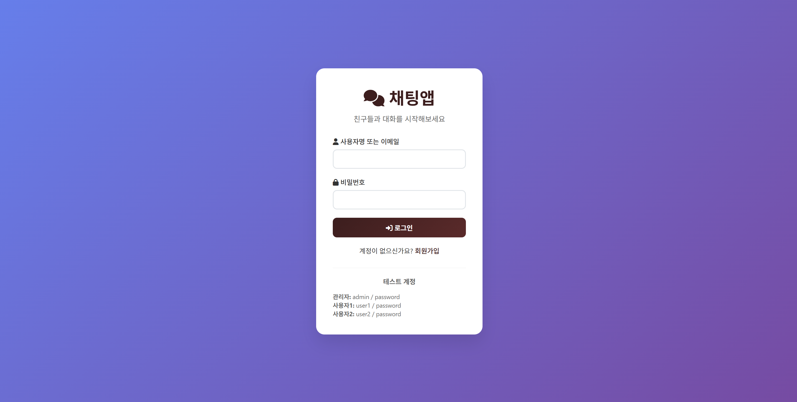
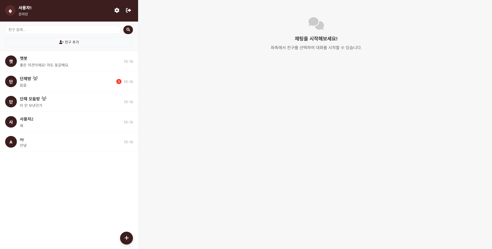
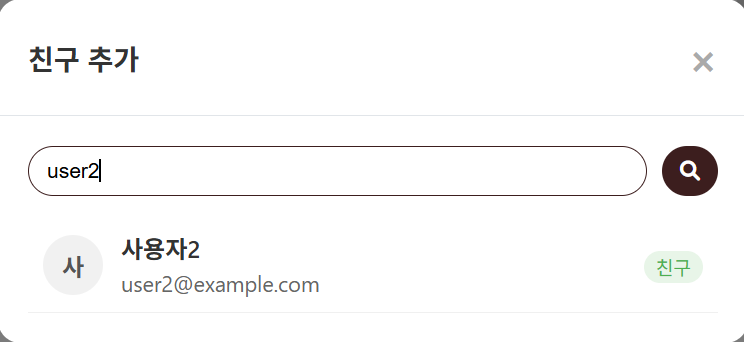
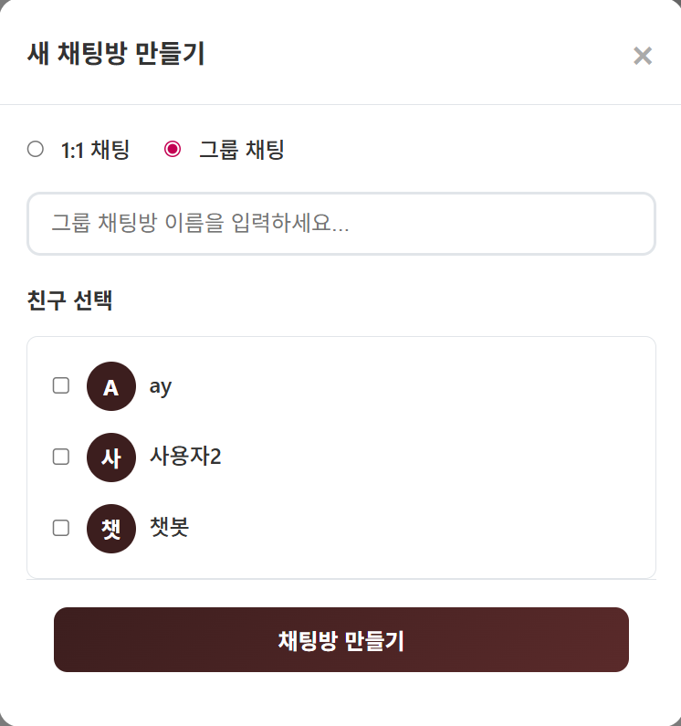
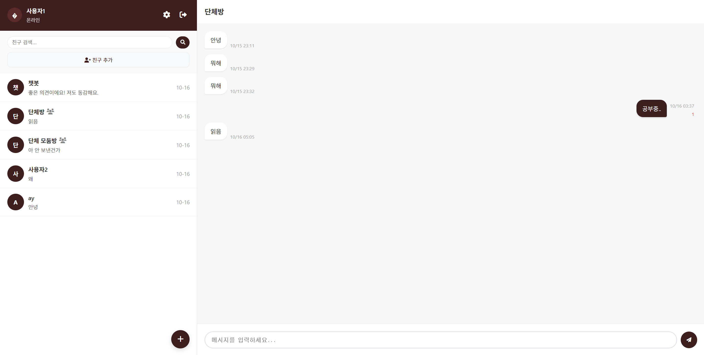
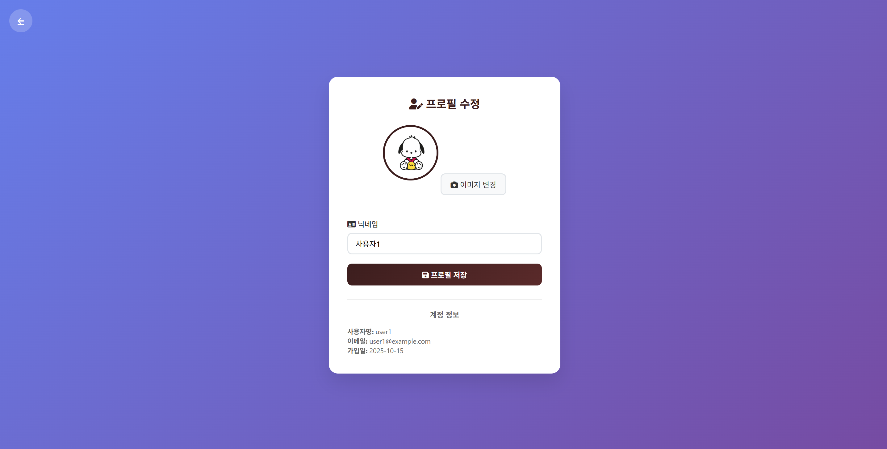

# Real-Time Web Chat Application


PHP와 MySQL 기반으로 구현한 **실시간 웹 채팅 애플리케이션**입니다.

카카오톡과 유사한 채팅 UI를 목표로 설계되었으며   
**사용자 인증, 친구 관리, 채팅방 생성, 메시지 저장, AJAX 기반 메시지 갱신, 챗봇 기능**을 포함합니다.

이 프로젝트는 **웹 채팅 서비스의 핵심 구조를 직접 구현하고 이해하는 것을 목표로 한 웹 서비스 개발 프로젝트**입니다.

---

<br>

# Project Overview

본 프로젝트는 **PHP + MySQL 기반 웹 채팅 시스템**을 직접 구현한 애플리케이션입니다.

**주요 목적**

* 웹 기반 실시간 채팅 서비스 구조 이해
* Client–Server 통신 방식 구현
* 데이터베이스 기반 메시지 처리 구조 구현
* AJAX 기반 비동기 메시지 갱신 시스템 구현

<br>

**구현한 핵심 기능**

* 사용자 로그인 / 회원가입
* 친구 목록 조회 및 친구 추가
* 1:1 채팅 및 채팅방 생성
* 메시지 저장 및 조회
* AJAX polling 기반 메시지 자동 갱신
* 키워드 기반 챗봇 응답 시스템

---

<br>

# Key Features

### User Authentication

* 회원가입 및 로그인 기능
* PHP Session 기반 인증 처리
* `password_hash()` 기반 비밀번호 암호화

---

### Friend Management

* 친구 목록 조회
* 친구 검색 기능
* 친구 추가 및 수락
* 채팅 대상 선택

---

### Messaging System

* 1:1 채팅 지원
* 메시지 저장 및 조회
* MySQL 데이터베이스 기반 메시지 관리
* **AJAX polling 방식 메시지 자동 갱신 (2~3초)**

---

### Chat Room

* 채팅방 생성
* 채팅방 참여자 관리
* 메시지 읽음 상태 관리

---

### Chatbot

간단한 키워드 기반 챗봇 시스템이 포함되어 있으며,   
특정 키워드 입력 시 자동 응답을 제공합니다.

<br>

**지원 키워드 예시**

Greeting

```
hello
hi
안녕
```

Weather

```
weather
날씨
```

Time

```
time
몇시
```

Mood

```
기분
좋아
슬퍼
```

---

<br>

# System Architecture

**전체 채팅 시스템 구조**

```
Client (Browser)
        │
        │ AJAX Request
        ▼
PHP API Endpoints
        │
        ▼
MySQL Database
        │
        ▼
JSON Response
        │
        ▼
Chat UI Update
```

AJAX polling을 통해 **실시간에 가까운 메시지 갱신**을 구현합니다.

---

<br>

# Database Schema

채팅 서비스 구현을 위해 다음 데이터 구조를 사용합니다.

```
users
friendships
chat_rooms
chat_room_participants
messages
message_reads
```

<br>

**주요 특징**

* 채팅방 기반 메시지 구조
* 메시지 읽음 상태 관리
* 친구 관계 관리
* 사용자 프로필 관리

---

<br>

# Tech Stack

### Backend

* PHP 8+

### Database

* MySQL 8

### Frontend

* HTML5
* CSS3
* JavaScript (AJAX)

### UI

* Font Awesome

### Server Environment

* XAMPP (Apache + MySQL)

---

<br>

# Screenshots

### Login



사용자 인증을 위한 로그인 화면입니다.

---

### Chat Interface



채팅방 목록과 친구 목록을 확인할 수 있는 메인 채팅 화면입니다.

---

### Add Friend



사용자 검색을 통해 친구를 추가할 수 있습니다.

---

### Create Chat Room



1:1 채팅 또는 그룹 채팅방을 생성할 수 있습니다.

---

### Group Chat



여러 사용자가 참여하는 그룹 채팅 기능을 제공합니다.

---

### Profile Management



닉네임 및 프로필 이미지를 수정할 수 있습니다.

---

<br>

# Project Structure

```
chat_app
│
├── api
│   ├── getMessages.php
│   ├── sendMessage.php
│   ├── getFriends.php
│   ├── getAllFriends.php
│   ├── createRoom.php
│   ├── addFriend.php
│   ├── acceptFriend.php
│   ├── searchFriend.php
│   ├── markRoomRead.php
│   ├── updateProfile.php
│   └── chatbot.php
│
├── assets
│   └── css
│
├── index.php
├── login.php
├── register.php
├── chat.php
├── profile.php
├── logout.php
│
├── database.sql
└── README.md
```

---

<br>

# Setup

### 1. XAMPP 설치

* Apache
* MySQL

---

### 2. 프로젝트 위치

```
C:/xampp/htdocs/chat_app
```

---

### 3. Database Import

```
http://localhost/phpmyadmin
```

`database.sql` 파일 import

---

### 4. 실행

```
http://localhost/chat_app/login.php
```

---

<br>

# Security

* `password_hash()` 기반 비밀번호 암호화
* Prepared Statements 기반 SQL Injection 방지
* `htmlspecialchars()` 기반 XSS 방지
* Session 기반 사용자 인증

---

<br>

# Future Improvements

* 그룹 채팅 기능
* 이미지 / 파일 전송
* WebSocket 기반 실시간 메시징
* Push Notification
* 메시지 검색 기능

---

<br>

# Author

Yeeun Park

GitHub: [DevLucia-21](https://github.com/DevLucia-21)
