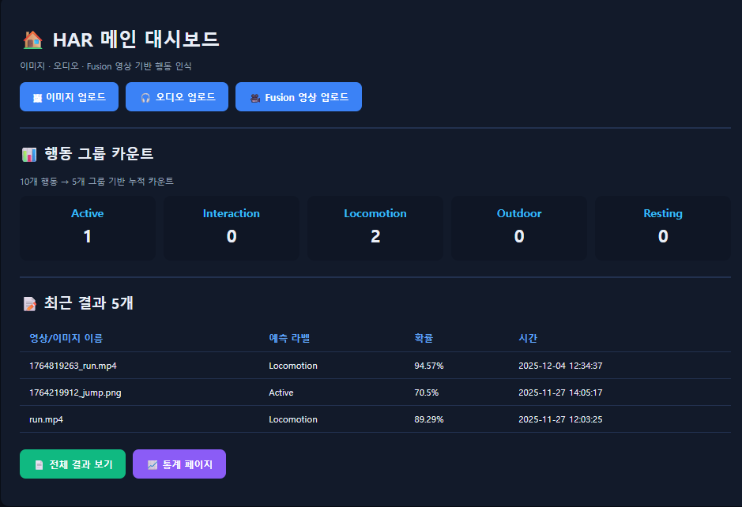
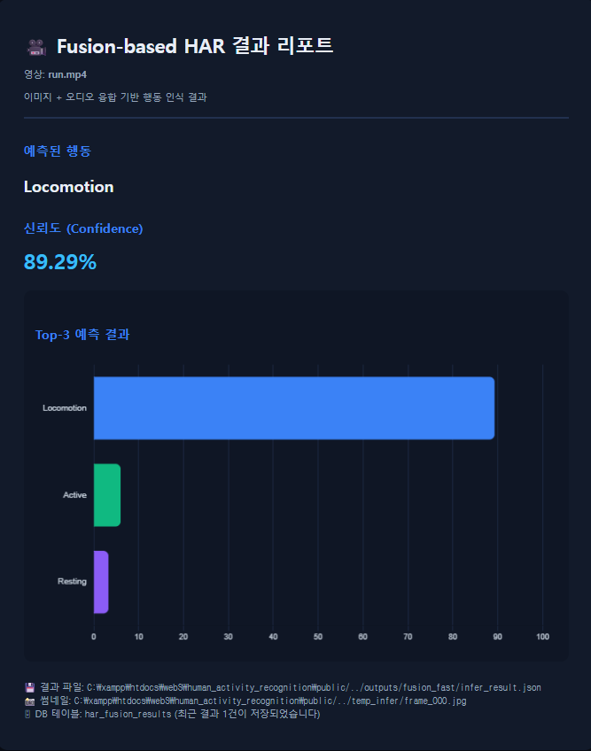
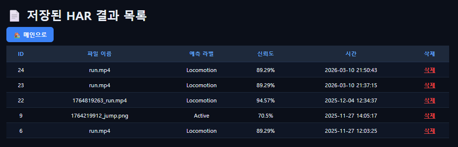
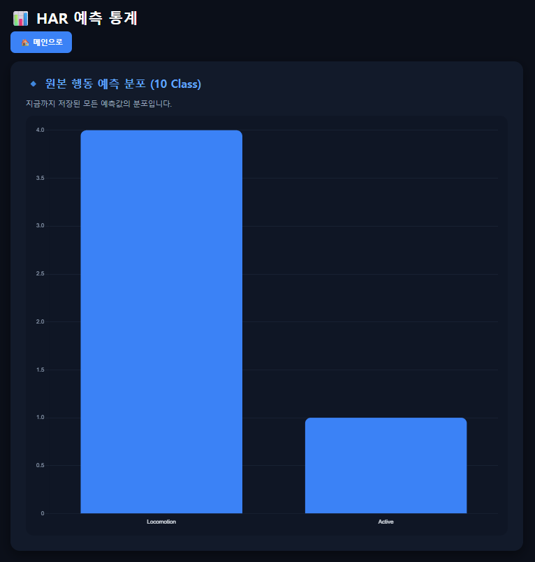
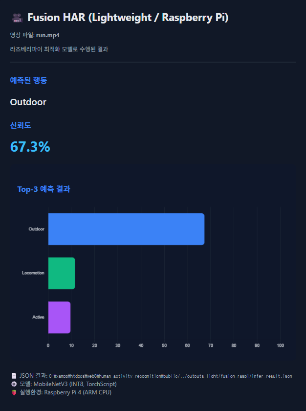

# Multimodal Human Activity Recognition System (HAR)
### Video + Audio Late Fusion

<br>


영상 정보와 환경 오디오 정보를 결합하여 인간 행동을 인식하는 **Multimodal Human Activity Recognition (HAR) 시스템** 프로젝트입니다.

<br>

본 프로젝트는 **HMDB51 (video)** 와 **ESC-50 (audio)** 데이터셋을 기반으로 각각의 ResNet-18 모델을 학습한 뒤,   
**Late Fusion 전략을 통해 두 모달리티를 결합하여 행동을 분류**합니다.

단순 모델 학습 실험을 넘어 다음 요소를 포함하는 **실험 관리 및 결과 분석 시스템 형태**로 구현되었습니다.

* 영상 기반 행동 인식 모델
* 오디오 기반 환경음 인식 모델
* Multimodal Late Fusion 기반 추론 시스템
* 실험 결과 저장 및 관리 구조
* PHP 기반 Web 인터페이스를 통한 결과 조회

---

## Project Overview

Human Activity Recognition (HAR)은 다음과 같은 다양한 분야에서 활용되는 핵심 기술입니다.

* 스마트 헬스케어
* 지능형 감시 시스템
* 스마트홈 환경
* 행동 기반 인터랙션 시스템

<br>

기존 HAR 연구는 대부분 **단일 모달리티 (single modality)** 기반으로 이루어져 왔습니다.   
그러나 실제 환경에서는 다음 두 가지 정보가 동시에 존재합니다.

* **Visual context** — 사람의 동작과 행동 패턴
* **Environmental audio context** — 행동 상황에서 발생하는 환경 소리

<br>

본 프로젝트에서는 이러한 정보를 결합한 **Multimodal HAR 시스템**을 구현하고,   
영상 기반 모델과 오디오 기반 모델을 **Late Fusion 방식으로 결합하여 행동 인식 성능을 향상시키는 방법을 분석합니다.**

---

### Web Interface

PHP 기반 웹 대시보드를 통해 HAR 추론 결과와 실험 기록을 확인할 수 있습니다.



---

## Key Features

본 프로젝트는 단순한 모델 실험 코드가 아니라 **멀티모달 행동 인식 시스템 구현**을 목표로 합니다.

주요 특징은 다음과 같습니다.

* **Multimodal Human Activity Recognition 시스템 구현**
* **Image Model + Audio Model 기반 Late Fusion 구조**
* **ResNet-18 기반 딥러닝 모델 학습**
* **Mel-spectrogram 기반 환경음 특징 추출**
* **실험 결과 자동 저장 및 관리 구조**
* **PHP 기반 Web 인터페이스를 통한 결과 조회**

실험 결과 **Late Fusion 기반 multimodal 모델이 단일 모달 모델보다 더 높은 성능을 보임을 확인했습니다.**

---

## Datasets

### HMDB51 (Video Dataset)

HMDB51은 널리 사용되는 **Human Action Recognition 비디오 데이터셋**입니다.

* 51개의 행동 클래스
* 다양한 실제 행동 장면 포함
* 다양한 촬영 환경 및 동작 패턴 포함

<br>

본 프로젝트에서는 비디오 데이터를 직접 처리하는 대신
**Frame Sampling 방식으로 대표 프레임을 추출하여 이미지 입력으로 사용합니다.**

또한 행동 클래스를 다음과 같은 **5개의 상위 행동 그룹 (activity groups)** 으로 재구성하여 사용했습니다.

* Active
* Interaction
* Locomotion
* Outdoor
* Resting

---

### ESC-50 (Audio Dataset)

ESC-50은 **Environmental Sound Classification 데이터셋**입니다.

* 50개의 환경음 클래스
* 다양한 실제 환경 소리 포함
* 환경 소리 분류 연구에서 널리 사용

<br>

본 프로젝트에서는 오디오 신호를 **Mel-spectrogram으로 변환하여 CNN 입력으로 사용합니다.**

이를 통해 행동 상황에서 발생하는 **환경적 음향 정보 (environmental audio context)** 를 활용합니다.

---

## Model Architecture

본 시스템은 다음 세 가지 구성 요소로 이루어집니다.

* Image-based HAR Model
* Audio-based HAR Model
* Multimodal Fusion Module

각 모달리티는 **독립적으로 학습**되며
추론 단계에서 **Late Fusion 방식**으로 결합됩니다.

---

### Image-based HAR Model

영상 기반 행동 인식 모델은 **ResNet-18 backbone을 사용하는 CNN 기반 분류 모델**입니다.

비디오 전체를 처리하는 대신 일정 간격으로 프레임을 샘플링하여 입력으로 사용합니다.

이 방식은 다음 특징을 가집니다.

* 비디오에서 **representative frames 추출**
* 프레임 단위 이미지 입력
* ResNet-18 기반 시각적 특징 학습
* 행동 클래스 예측 logits 생성

<br>

본 프로젝트에서는 복잡한 temporal sequence 모델 대신
**frame-based representation learning 방식**을 사용합니다.

이를 통해 행동 장면에서 나타나는 **대표적인 시각적 패턴 (visual patterns)**을 효율적으로 학습합니다.

---

### Audio-based HAR Model

오디오 기반 모델 역시 **ResNet-18 기반 CNN 모델**을 사용합니다.

오디오 데이터는 CNN에 직접 입력할 수 없기 때문에
먼저 **Mel-spectrogram으로 변환하여 이미지 형태의 특징 표현을 생성합니다.**

Mel-spectrogram은 오디오 신호를 **time–frequency representation**으로 변환한 특징 표현입니다.

이를 통해 모델은 다음 정보를 학습합니다.

* 환경 소리 패턴
* 행동 상황에서 발생하는 음향 특징
* 행동과 연관된 주변 환경 정보

---

### Multimodal Fusion

영상 모델과 오디오 모델은 각각 **행동 예측 logits**를 생성합니다.

최종 예측은 **Late Fusion 방식**으로 결합됩니다.

본 프로젝트에서는 **Score-level weighted linear fusion**을 사용합니다.

Final prediction

```
z_fusion = α · z_img + (1 − α) · z_aud
```

where

* `z_img` : image model logits
* `z_aud` : audio model logits
* `α` : fusion weight

실험에서는 다음 가중치를 사용했습니다.

* Image : **0.6**
* Audio : **0.4**

fusion logits에 **Softmax**를 적용하여 최종 행동 클래스를 예측합니다.

이 방식은 다음과 같은 **모달리티 보완 효과**를 제공합니다.

* 시각 정보가 중요한 행동 → Image 모델 영향 증가
* 환경 소리가 중요한 행동 → Audio 모델 보완

---

## Experimental Results

실험 결과는 다음과 같습니다.

| Model        | Accuracy   | Macro-F1   |
| ------------ | ---------- | ---------- |
| Image Model  | 82.08%     | 83.46%     |
| Audio Model  | 85.00%     | 84.00%     |
| Fusion Model | **92.67%** | **92.49%** |

Late Fusion 기반 multimodal 모델은 **단일 모달 모델보다 더 높은 성능을 보였습니다.**

---

### Fusion-based HAR Result

Late Fusion 기반 Multimodal HAR 모델의 추론 결과 예시입니다.



---

특히 다음 행동 그룹에서 성능 향상이 크게 나타났습니다.

* Interaction
* Outdoor
* Active

이는 **environmental audio context가 행동 인식에 중요한 보완 정보를 제공함**을 보여줍니다.

---

## System Implementation

이 프로젝트는 단순한 모델 학습 코드가 아니라
**실험 관리 및 결과 분석을 위한 시스템 구조**로 구현되었습니다.

주요 구성 요소는 다음과 같습니다.

* Python 기반 딥러닝 학습 파이프라인
* Multimodal inference 시스템
* 실험 결과 저장 구조
* MySQL 기반 결과 관리
* PHP 기반 Web 인터페이스

<br>

웹 인터페이스를 통해 다음 기능을 수행할 수 있습니다.

### Stored Prediction Results

데이터베이스에 저장된 HAR 추론 기록을 확인할 수 있습니다.



---

### Prediction Statistics

저장된 모든 예측 결과를 기반으로 행동 분포 통계를 시각화합니다.



* inference 결과 저장
* 실험 기록 관리
* 결과 통계 확인

---

### Lightweight Model (Raspberry Pi)

라즈베리파이 환경에서 실시간 추론을 수행하기 위해  
MobileNetV3 기반 INT8 양자화 모델을 적용했습니다.



---

## Project Structure

```
human_activity_recognition
│
├── images                 # README screenshots
├── public
├── py
├── py_light
├── sql
│
├── temp_infer
├── temp_infer_raspi
│
├── HAR_Project_Guide.md
├── README.md
└── requirements.txt
```

* `py/` : 모델 학습 및 추론 코드
* `py_light/` : 경량 실행용 코드
* `public/` : PHP 기반 Web 인터페이스
* `sql/` : 결과 관리용 데이터베이스 스크립트

실험 결과는 `outputs` 계열 디렉터리에 저장되며
Web 인터페이스에서 조회할 수 있습니다.

---

## System Workflow

```
Video Frame → Image Model
Audio → Audio Model

        ↓

    Late Fusion

        ↓

Prediction Result

        ↓

    Database 저장

        ↓

Web Dashboard 조회
```

---

## Tech Stack

### Language

* Python
* PHP

### Deep Learning

* PyTorch
* ResNet-18

### Data Processing

* OpenCV
* Librosa
* Pandas
* NumPy
* SciPy
* scikit-learn

### Database

* MySQL

### Web

* PHP
* HTML
* CSS

---

## Author

Yeeun Park  
Anyang University  
Department of Information, Electrical and Electronic Engineering  

GitHub: [DevLucia-21](https://github.com/DevLucia-21)

---

### Related Research

*Semantic-Aligned Multimodal Human Activity Recognition Using Visual and Audio Data*
