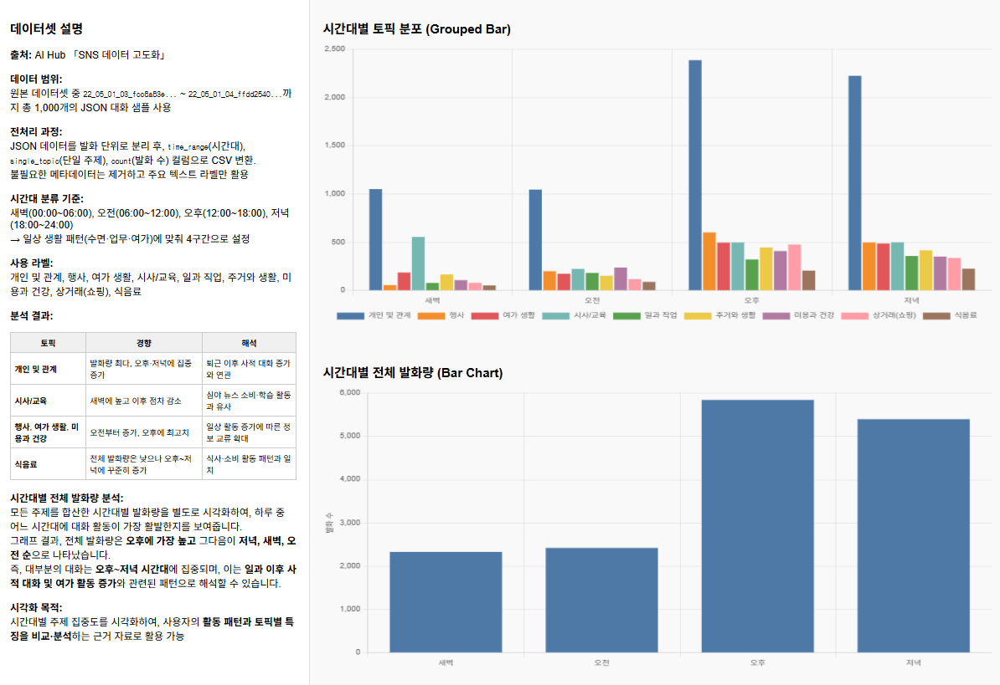
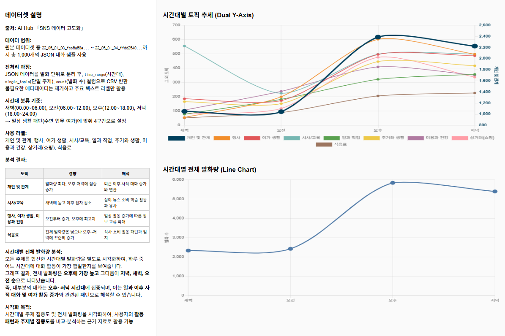

# SNS Topic Analysis & Visualization


SNS 데이터를 분석하고 **시간대별 토픽 분포를 시각화하는 데이터 분석 프로젝트**입니다.

Python 기반 데이터 처리 스크립트를 통해 SNS 데이터를 가공하고   
분석 결과를 **웹 기반 차트 (Chart.js)** 로 시각화할 수 있도록 구현했습니다.

이 프로젝트는 **데이터 처리 파이프라인 + 웹 기반 데이터 시각화 구조를 함께 구현하는 것을 목표로 합니다.**

---

## Project Overview

본 프로젝트는 SNS 대화 데이터 (JSON 형식)를 분석하여   
시간대별 토픽 분포를 시각화하는 데이터 분석 파이프라인을 구현합니다.

<br>

전체 분석 과정은 다음과 같이 구성됩니다.

1️⃣ SNS 데이터 수집   
2️⃣ Python 기반 데이터 가공   
3️⃣ CSV 분석 데이터 생성   
4️⃣ 웹 페이지에서 차트 기반 시각화   

<br>

이를 통해 다음 기술을 함께 실습합니다.

* Python 기반 데이터 처리
* CSV 기반 데이터 분석
* 웹 기반 데이터 시각화
* 데이터 분석 결과의 웹 서비스 연동

### Dataset Source

*AI Hub SNS Dialogue Dataset*

---

## Key Features

### Data Processing

* SNS 데이터 JSON 구조 분석
* Python 기반 데이터 변환 스크립트
* CSV 데이터 생성

---

### Topic Analysis

* SNS 대화 데이터에서 **topic 정보 추출**
* 시간대별 데이터 분류
* 토픽 빈도 집계

---

### Visualization Support

분석 결과를 **웹 기반 차트로 시각화**합니다.

**지원 차트 유형**

* Line Chart
* Grouped Bar Chart
* Stacked Bar Chart
* Dual Y-Axis Chart

웹 페이지에서 **토픽 분포와 시간대별 데이터 변화를 직관적으로 확인할 수 있습니다.**

---

## Data Processing Pipeline

전체 데이터 처리 흐름은 다음과 같습니다.

```
SNS JSON Data
        │
        ▼
Python Script
(convert_to_csv.py)
        │
        ▼
Topic Extraction
        │
        ▼
CSV Data Generation
        │
        ▼
Chart Visualization
(public folder)
```

Python 스크립트는 SNS 데이터에서 토픽 정보를 추출하고   
시간대별 토픽 빈도를 계산하여 CSV 데이터로 변환합니다.

---

## Web Visualization

분석 결과는 `public` 디렉터리의 웹 페이지에서 확인할 수 있습니다.

**예시 페이지**

* Line Chart
* Grouped Bar Chart
* Stacked Bar Chart
* Dual Y-Axis Chart

각 페이지는 **Chart.js 기반 데이터 시각화**를 사용하여   
SNS 토픽 분포와 시간대별 활동 패턴을 그래프로 표현합니다.

---

### Topic Distribution Dashboard



시간대별 주요 토픽 분포(Grouped Bar Chart)와 전체 발화량(Bar Chart)을 함께 시각화한 결과입니다.  
각 시간대(새벽, 오전, 오후, 저녁)에서 어떤 주제가 많이 등장하는지 비교할 수 있습니다.

---

### Topic Trend Dashboard



시간대별 토픽 변화 추이(Dual Y-Axis Chart)와 전체 발화량 흐름(Line Chart)을 함께 시각화한 결과입니다.  
시간대별 사용자 활동 패턴과 주제 변화 경향을 확인할 수 있습니다.

---

## Project Structure

```
sns_topic_analysis
│
├── images                 # README charts
│
├── output                 # 분석 결과 CSV 저장
│
├── public                 # 데이터 시각화 웹 페이지
│
└── scripts
     └── convert_to_csv.py # SNS 데이터 → CSV 변환 스크립트
```

* `scripts/` : 데이터 처리 Python 스크립트
* `output/` : 분석 결과 데이터 저장
* `public/` : 웹 기반 데이터 시각화 페이지

---

## Tech Stack

### Data Processing

* Python

### Data Visualization

* Chart.js

### Web

* HTML
* CSS
* JavaScript
* PHP

### Server Environment

* Apache (XAMPP)

---

## Run Environment

* Python 3+
* Apache / XAMPP

---

## Author

Yeeun Park

GitHub: [DevLucia-21](https://github.com/DevLucia-21)
